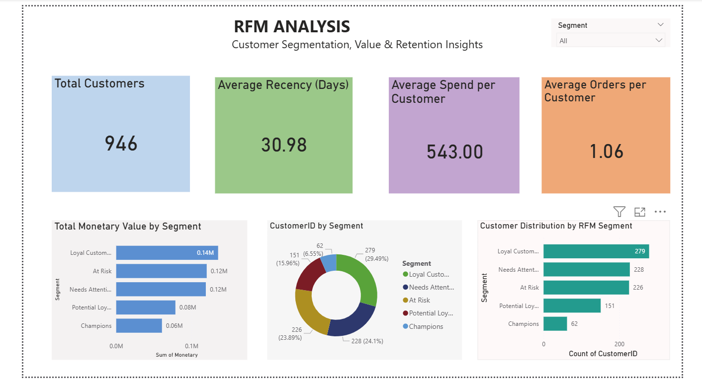

# Customer Segmentation & RFM Analysis

## Project Overview
This project analyzes customer purchasing behavior using Recency, Frequency, and Monetary (RFM) analysis. The goal is to segment customers into meaningful groups and support data-driven marketing and retention strategies.

## Tools & Technologies
- Excel — data review and preparation
- MySQL — querying transaction data and calculating RFM metrics
- Python (Pandas, Matplotlib) — analysis and visualization
- Power BI — interactive dashboard

## RFM Metrics
- Recency: how recently a customer made a purchase
- Frequency: how often a customer purchased
- Monetary: the total amount spent by a customer

## Customer Segments
- Champions
- Loyal Customers
- Potential Loyalists
- At Risk
- Needs Attention

## Dashboard Highlights
- Customer distribution across RFM segments
- Key metrics: customer count, average recency, average orders, and average spend
- Segment-level monetary value comparison
- Segment dropdown for interactive filtering

## Dashboard Preview

## Dataset
The analysis uses a transaction dataset containing customer IDs, purchase dates, transaction amounts, order IDs, product information, and location.

## Project Structure
- `rfm_data.csv` — source dataset
- `rfm_data.cleaned.xlsx` — cleaned dataset
- `rfm analysis.sql` — SQL analysis script
- `python_analysis/` — Python analysis and output files
- `RFM Customer Segmentation Dashboard.pbix` — Power BI dashboard
- `Documentation/` — project documentation and screenshots

## Key Takeaway
RFM analysis helps identify high-value customers, loyal customers, and customers who may need re-engagement. These segments can guide targeted marketing and customer retention efforts.

## Author
Data Analytics Portfolio Project
